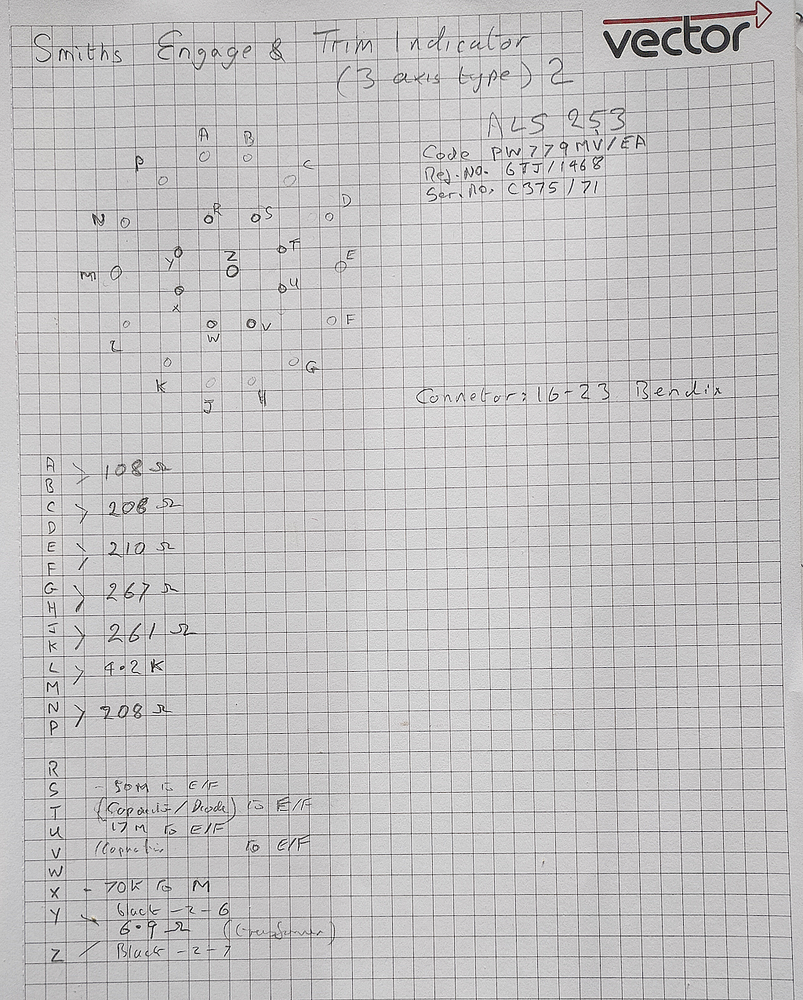

# Aviation_Engage_and_Trim_Indicator
Smiths (Three axis type) 2 ALS 253

[Photos](images/README.md)

Little known about this, the indicator seem to be like meter movements. There are status flags under each instrument. Inside there are three small transformers and a single larger one. There are various resistors, capacitors, and diodes but no transistors.

I suspect the input channles are using a magnetic amplifier to isolate the indicators from the inputs. no idea about the flag drivers yet. The front section is in a sealed chamber seperate from the rear electronics.

